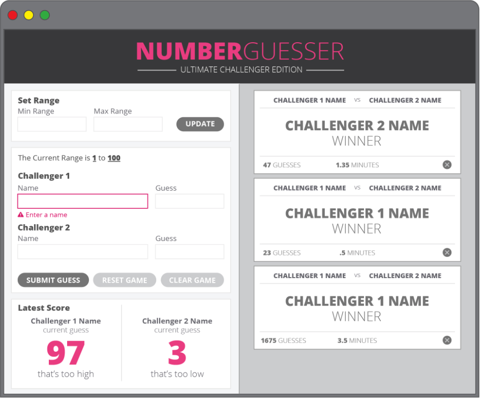
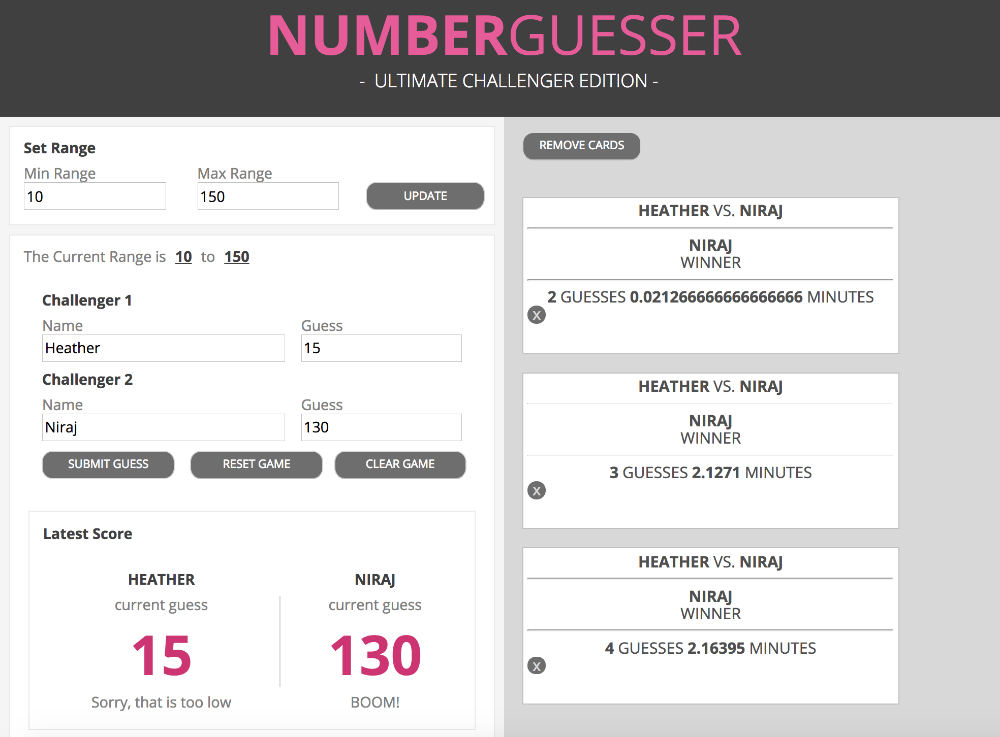

# Number Guesser Project
Heather Hartley & Niraj Aryal

## Overview
- Creating a number guesser game that can be played between 2 players
- Generating a random number each time the game is started or reset
- Has a min and max range value, which increases and decreases by incremenents of 10 every time a player guesses the correct answer
- Has various buttons: submit, clear, reset, and clear all cards
- Pops up winner card on right side of screen when a player wins
- Has a responsive screen layout for both computer and mobile devices using media queries, flex-box, and display properties
- Counts the total number of player guesses and displays on winner card
- Counts and records amount of running game time (based on when submit button is clicked to start game and end game)

## Original project img

## Our project img

